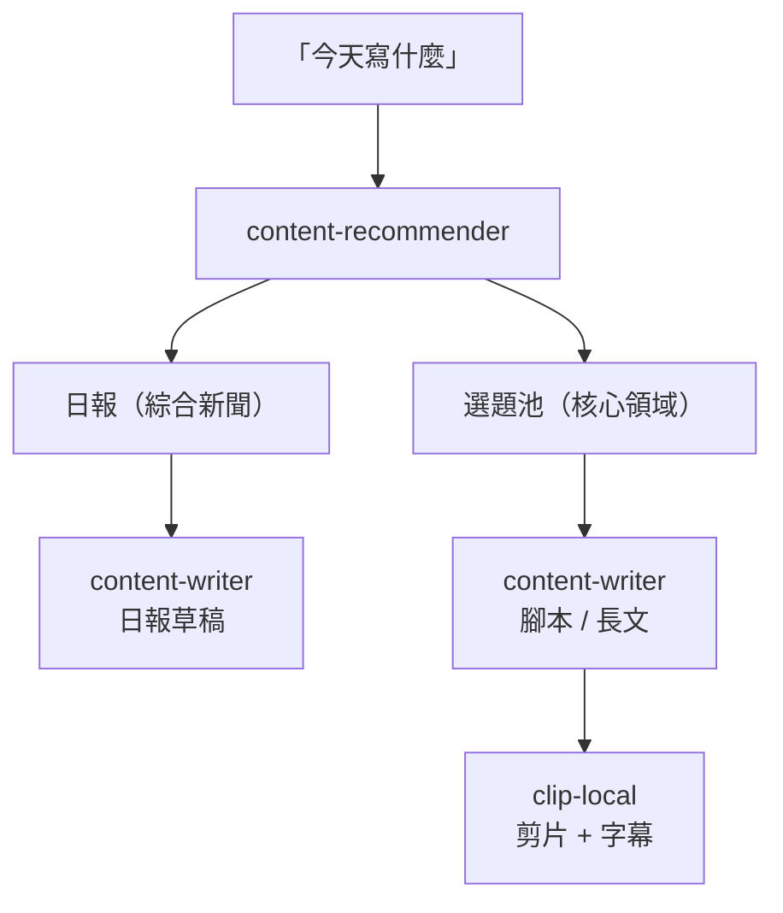

<p align="center">
  <h1 align="center">content-skills</h1>
  <p align="center">內容產出 skills — 從選題、撰寫到影片剪輯，一站完成。</p>
  <p align="center">
    <a href="https://github.com/anthropics/claude-code"></a>
    <a href="https://github.com/chyyynh/content-skills"></a>
    <a href="https://github.com/chyyynh/content-skills"></a>
  </p>
</p>

---

## 安裝

```bash
# 加入 marketplace
/plugin marketplace add chyyynh/content-skills

# 安裝想要的 plugin（可分開裝）
/plugin install content-recommender@content-skills
/plugin install content-writer@content-skills
/plugin install clip-local@content-skills
```

<details>
<summary>本地測試</summary>

```bash
git clone https://github.com/chyyynh/content-skills.git
claude --plugin-dir ./content-skills
```

</details>

## Prerequisites

| 依賴 | 用途 | 安裝 |
|------|------|------|
| [newsence](https://www.npmjs.com/package/newsence) | 文章資料來源（recommender / writer） | `claude mcp add newsence -- npx newsence mcp` |
| yt-dlp | 影片下載（clip-local） | `brew install yt-dlp` |
| ffmpeg | 影片處理（clip-local） | `brew install ffmpeg` |
| GROQ_API_KEY | Whisper 語音轉文字（clip-local，可選） | [console.groq.com](https://console.groq.com) |

## Skills

### `content-recommender` — 選題推薦

> 分析近期文章，推薦值得產出的內容主題，附建議角度和參考資料。

**觸發**：`今天寫什麼` `有什麼新聞` `最近什麼話題火` `XXX 要不要跟`

```
確認需求 → newsence 拉取文章 → 篩選歸類 → 輸出推薦 brief
```

每個推薦包含：為什麼值得做、建議角度、可直接用於寫作的參考文章（標註角色：核心素材、對立觀點、數據來源等）。也支援追熱點判斷 — 分析報導密度和趨勢階段，給出跟/不跟建議。

---

### `content-writer` — 內容撰寫

> 根據主題和參考資料，產出不同管道的內容草稿。

**觸發**：`寫日報` `寫腳本` `幫我寫一篇` `開始吧`

| 管道 | 平台 | 預設風格 |
|------|------|---------|
| 日報 | 微信公眾號 | 犀利洞察 × 快報 × 客觀 |
| 短影片腳本 | 小紅書 / 抖音 | 輕鬆幽默 × 中度 × 對話體 |
| 長文 | 公眾號 | 溫和專業 × 深度 × 第一人稱 |
| Thread | Twitter/X | 犀利洞察 × 中度 × 第一人稱 |

```
確認素材 + 管道 → 讀取全文 → 選擇風格 → 大綱確認 → 產出草稿
```

支援自訂品牌風格 — 建立 `references/custom-style.md` 後自動生效。

---

### `clip-local` — 影片剪輯 + 字幕

> 本地剪輯影片，支援翻譯字幕、CapCut 風格逐詞高亮、自動精華偵測。

**觸發**：`幫我剪這個影片` `加中文字幕` `clip the best parts`

**支援來源**：YouTube、X/Twitter，以及 yt-dlp 支援的所有平台。

```
取得影片資訊 → 下載/轉錄字幕 → 翻譯 → 產生卡拉OK字幕 → 截圖檢查內嵌字幕 → 合成影片
```

- **逐詞高亮** — CapCut 風格，灰→白逐詞亮起
- **雙語字幕** — 原文在上（帶高亮），翻譯在下
- **自動精華** — 不指定時間時，自動推薦 3-5 個精華段落
- **內嵌字幕處理** — 自動截圖偵測，用 `drawbox` 黑條蓋住避免重疊
- **Whisper fallback** — 無字幕時透過 Groq API 語音轉文字

## 工作流程



三個 skill 可以串接使用，也可以各自獨立：

- **只要選題** — `今天有什麼值得做的題目`
- **只要寫作** — `幫我把這篇文章改寫成 Twitter Thread`
- **只要剪片** — `幫我剪這個 YouTube 影片 1:20-3:40 加中文字幕`
