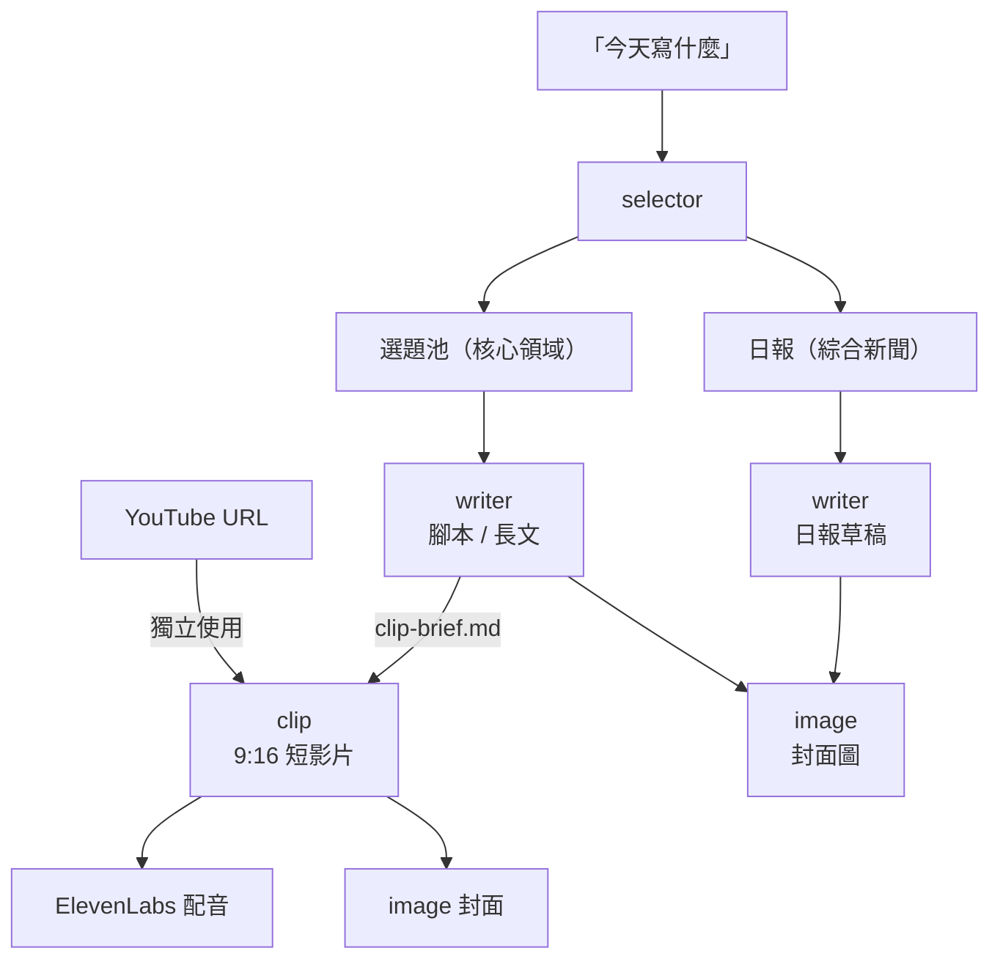

<p align="center">
  <h1 align="center">content-skills</h1>
  <p align="center">內容產出 skills — 從選題、撰寫到影片剪輯，一站完成。</p>
  <p align="center">
    <a href="https://github.com/anthropics/claude-code"></a>
    <a href="https://github.com/chyyynh/content-skills"></a>
    <a href="https://github.com/chyyynh/content-skills"></a>
  </p>
</p>

---

## 安裝

```bash
# 加入 marketplace
/plugin marketplace add chyyynh/content-skills

# 安裝想要的 plugin（可分開裝）
/plugin install selector@content-skills
/plugin install writer@content-skills
/plugin install clip@content-skills
/plugin install image@content-skills
```

<details>
<summary>本地測試</summary>

```bash
git clone https://github.com/chyyynh/content-skills.git
claude --plugin-dir ./content-skills
```

</details>

## Prerequisites

| 依賴 | 用途 | 安裝 |
|------|------|------|
| [newsence](https://www.npmjs.com/package/newsence) | 文章資料來源（selector / writer） | `claude mcp add newsence -- npx newsence mcp` |
| yt-dlp | 影片下載（clip） | `brew install yt-dlp` |
| ffmpeg | 影片處理（clip） | `brew install ffmpeg` |
| GROQ_API_KEY | Whisper 語音轉文字（clip，可選） | [console.groq.com](https://console.groq.com) |
| ELEVENLABS_API_KEY | Hook 配音（clip，可選） | [elevenlabs.io](https://elevenlabs.io) |
| OPENROUTER_API_KEY | 圖片生成（image / clip 封面） | [openrouter.ai/settings/keys](https://openrouter.ai/settings/keys) |

## Skills

### `selector` — 選題推薦

> 分析近期文章，推薦值得產出的內容主題，附建議角度和參考資料。

**觸發**：`今天寫什麼` `有什麼新聞` `最近什麼話題火` `XXX 要不要跟`

```
確認需求 → newsence 拉取文章 → 篩選歸類 → 輸出推薦 brief
```

每個推薦包含：為什麼值得做、建議角度、可直接用於寫作的參考文章（標註角色：核心素材、對立觀點、數據來源等）。也支援追熱點判斷 — 分析報導密度和趨勢階段，給出跟/不跟建議。

---

### `writer` — 內容撰寫

> 根據主題和參考資料，產出不同管道的內容草稿。

**觸發**：`寫日報` `寫腳本` `幫我寫一篇` `開始吧`

| 管道 | 平台 | 預設風格 |
|------|------|---------|
| 日報 | 微信公眾號 | 犀利洞察 × 快報 × 客觀 |
| 短影片腳本 | 小紅書 / 抖音 | 輕鬆幽默 × 中度 × 對話體 |
| 長文 | 公眾號 | 溫和專業 × 深度 × 第一人稱 |
| Thread | Twitter/X | 犀利洞察 × 中度 × 第一人稱 |

```
確認素材 + 管道 → 讀取全文 → 選擇風格 → 大綱確認 → 產出草稿
```

支援自訂品牌風格 — 建立 `references/custom-style.md` 後自動生效。短影片腳本會自動產出 `clip-brief.md`，clip skill 可直接讀取執行。

---

### `clip` — 短影片一鍵產出

> 丟一個 YouTube 連結，自動產出 9:16 短影片：AI 封面 + ElevenLabs 配音 Hook + 翻譯字幕 + CapCut 風格卡拉OK。

**觸發**：`幫我剪這個影片` `做成短影片` `加中文字幕` `clip the best parts`

**支援來源**：YouTube、X/Twitter，以及 yt-dlp 支援的所有平台。

#### Pipeline

```
1. 取得影片資訊與語言
2. 下載原文字幕（或 Whisper 轉錄）
3. 裁切字幕到剪輯範圍
4. 去重提取乾淨段落
5. Claude 翻譯
6. 產生 ASS 卡拉OK字幕（雙語 / 純翻譯）
7. 截圖偵測內嵌字幕
8. 合成影片（支援 9:16 豎屏）
9. 短影片 Intro — Hook 腳本 + AI 封面 + ElevenLabs 配音 + CTA 片尾
```

#### 字幕系統

- **逐詞高亮** — CapCut 風格，灰→白逐詞亮起，CJK 按字、非 CJK 按詞
- **雙語字幕** — 原文在上（帶高亮），翻譯在下
- **純翻譯模式** — 只顯示翻譯，大字居中
- **自動去重** — YouTube 滾動字幕自動去除重疊，119 行 → 59 段
- **內嵌字幕處理** — 自動截圖偵測，用 `drawbox` 黑條蓋住避免重疊

#### 9:16 短影片格式

- **模糊背景**（預設）— 原始 16:9 畫面居中，上下模糊填充，保留完整畫面
- **中央裁切** — 適合講者正中央的 talking head 內容

#### Hook + AI 封面 + 配音

- **Hook 腳本** — 內建 8 種公式（懸念、顛覆、緊急、數據、錯誤、轉變、FOMO、直球），根據內容自動選擇
- **AI 封面** — 透過 image plugin 生成 9:16 封面圖（需 `OPENROUTER_API_KEY`）
- **ElevenLabs 配音** — Hook 文案自動 TTS 生成語音（需 `ELEVENLABS_API_KEY`）
- **CTA 片尾** — 可選的結尾引導畫面，支援配音或純文字
- **Concat** — intro + 主片段 + outro 自動拼接

#### 其他

- **自動精華** — 不指定時間時，自動推薦 3-5 個精華段落供挑選
- **Whisper fallback** — 無字幕時透過 Groq API 語音轉文字
- **Writer 銜接** — 支援讀取 writer 產出的 `clip-brief.md`，直接用腳本的 Hook 和封面描述

---

### `image` — 圖片生成

> 透過 OpenRouter 生成圖片，支援文字生圖、參考圖片編輯、寬高比控制。

**觸發**：`生成一張圖` `畫一張封面` `幫我做配圖`

```
接收 prompt → 呼叫 OpenRouter API → 儲存圖片
```

- **多模型** — 預設 Gemini 3.1 Flash，可切換 OpenRouter 上任何圖片模型
- **參考圖片** — 傳入現有圖片進行編輯或風格參考
- **寬高比** — 支援 `1:1`、`16:9`、`9:16`、`4:3` 等
- **Prompt 檔案** — 從 markdown 檔案讀取 prompt，自動剝離 YAML frontmatter

## 工作流程



四個 skill 可以串接使用，也可以各自獨立：

- **只要選題** — `今天有什麼值得做的題目`
- **只要寫作** — `幫我把這篇文章改寫成 Twitter Thread`
- **只要剪片** — `幫我剪這個 YouTube 影片做成短影片`
- **只要生圖** — `幫我生成一張 9:16 的封面圖`
